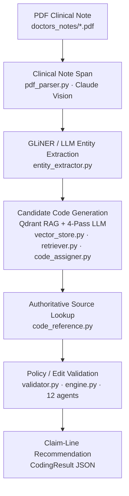

# Podiatry Medical Coding & Clean-Claim Scrubber

Translates podiatry clinical notes (PDF) into ICD-10-CM, CPT, HCPCS, and SNOMED CT codes,
then runs every claim line through a **14-filter pre-submission compliance scrub**.
Only fully clean claims pass; anything that fails any filter is routed to review with
the specific reason, denial risk, and the authoritative rule that triggered it.

> **Interactive pipeline diagram** — open [`pipeline.html`](pipeline.html) in any browser for a
> clickable stage-by-stage breakdown with inputs, outputs, technology, and key details per step.

---

## Pipeline



---

## Production operating model

**Two stages, two costs.** The pipeline is split into two stages with very
different economics, and everything about how notes re-run follows from it:

1. **The generative stage** — vision extraction of the PDF, NER, RAG
   retrieval, the 4-pass LLM coding. Expensive, stochastic, and its raw
   output (the LLM's coding *before* any layer touched it) is saved per
   run.
2. **The deterministic stack** — every validator layer, rule, template,
   gate, and the compliance scrubber. Cheap and reproducible.

**Replay re-executes the entire deterministic stack, never the stale
decisions.** When the growth loop improves the layers (a new rule,
template, or gate), a note's stored generative output is pushed through
the updated stack from scratch — every layer re-decides, so the same note
gets a genuinely new deterministic decision under the improved pack, at
zero LLM spend. For anything that operates after coding (which is where
nearly all rules, arbitration layers, demotions, modifier gates, and
scrubber filters live), replay is identical to fully reprocessing the
note. Fresh full runs are spent only when an improvement could have
changed what the generative stage itself sees (a candidate filter that
keeps a bad code out of the prompt, registry exemplar injection) or when
the failure is repeatability itself (the unanimity loop reprocesses
holdouts end to end) — never to re-ask the same question hoping for a
luckier answer.

Every note runs **3 independent times** (`CONSISTENCY_RUNS=3`, the default):

1. **Unanimous on all billing arrays** (ICD/CPT/HCPCS codes, primary/secondary
   types, modifiers, units) → eligible for auto-submission. The deterministic
   layers validated the claim; repeatability confirms no decision was a
   knife-edge draw. SNOMED variance is recorded but never gates routing (it
   doesn't appear on a CMS-1500).
2. **Any billing disagreement** → review is **deferred, never immediate**.
   The saved result embeds the full per-code disagreement report (present in
   1/3 runs, modifiers flipped across runs, units differ, ...) but stays off
   the human queue while automation still has moves to make: the post-batch
   growth loop (below) gets its shot first, and only what survives it is
   routed to REVIEW. The human is the tiebreaker — never the vote: the saved
   result is one coherent run (the majority-agreeing one), not a synthetic
   claim assembled from per-code frequencies.
3. **Self-deploying deterministic layers** — the growth loop that runs
   after every consistency batch, fully automated end to end:
   1. *Flip triage* (`tools/flip_triage.py`) clusters every billing
      disagreement into a **flip class** (same kind/array/code pattern) in
      an idempotent queue (`data/registry/flip_queue.jsonl`), with per-run
      evidence and the note sentences that speak the code's descriptor.
   2. *Auto-actuation* (`tools/auto_actuate.py`) assembles an evidence
      dossier per open class (note text, per-run entries, authoritative
      reference data), has a reasoning LLM draft a **declarative rule** for
      one of the rule-engine templates (config, never code, never a
      hardcoded medical code) — or escalate. An escalation that names the
      missing *mechanic* (rather than genuine ambiguity) carries a
      structured `missing_template` hint instead of dying in the human
      queue: see template synthesis below. A proposal that instead
      **cites a template that doesn't exist yet** is treated as the same
      signal, not a dead end: the structural gate rejects the rule, and
      the rejection converts into a `missing_template` hint carrying the
      attempted rule as the mechanic's spec — so a template gap surfaced
      either way flows into synthesis, and the note that exposed it gets
      re-run against the new template on the next pass.
   2b. *Template synthesis* — when escalations agree the blocker is
      vocabulary, the reasoning model **designs the missing template
      itself**: a sandboxed Python module (`data/rules/auto_templates/`)
      plus the first rule that uses it. The code passes a strict static
      gate before it can ever load — only `import re`, a minimal builtins
      whitelist, no while loops / classes / dunders / recursion / I/O, and
      no literal medical codes anywhere in the source — then the
      template+rule pair must clear every rule gate below, including full
      replay verification. Ground truth is a design INPUT, not just a
      gate: any dossier document with a registry-verified claim carries
      that exact claim as the target its replay must land on, and the
      design contract mandates single-axis mutation (arbitrate one
      attribute, touch nothing else) with code-class facts (E/M-ness,
      drug/supply-ness, line bundling) derived only from reference data,
      never literal ranges. A repair attempt gets the exact gate failure
      fed back — including, for registry/inertness violations, the
      row-level diff of what its replay produced vs. the claim it had to
      land on; still failing, the file is removed and the class stays
      escalated. Accepted templates join the proposer's vocabulary
      immediately (their self-documented schema is injected into the
      proposal prompt), and every stale "no template fits" escalation
      auto-reopens against them.
   3. *Acceptance gates* — every proposal must pass, deterministically:
      structural validity; no code literals in any selecting field
      (category-prefix regexes like `^M77\.` pass, full codes like
      `^M77\.41$` reject); **convergence** (replaying the stored runs with
      the rule makes them agree about the flip's own codes); **no-harm**
      (no document's replay gets more divergent); **inertness** on every
      already-unanimous note; and **registry protection** — a rule that
      alters the replay of ANY registry-verified claim is rejected
      outright, human-verified claims being settled ground truth. One
      directional exception: replays that all land byte-identical ON the
      verified claim itself are convergence onto ground truth (required
      when a verified note flips again and any effective rule must touch
      its replay), never movement away from it.
   4. *Replay reconciliation* (`tools/replay_reconcile.py`) realizes an
      accepted rule on the batch that produced it: the still-split notes'
      stored runs are replayed through the updated pack (validator +
      scrubber, both deterministic — zero LLM spend); notes whose replayed
      claims now agree are rewritten unanimous and auto-recorded to the
      registry in the same batch.
   5. *Expert-coder adjudication* (`tools/coder_adjudicator.py`) — what
      survives actuation + reconciliation is judgment-shaped by
      construction: modifier-25 significance, E/M MDM leveling,
      documentation sufficiency — calls no *generic* deterministic rule
      can decide. Before any human sees them, an automated expert coder
      (Fable 5) adjudicates each holdout under a binding protocol:
      judgment is **rule application, never intuition** — every
      determination must cite its authority (NCCI Policy Manual Ch. 1,
      the licensed AMA MDM level-selection table served as structured,
      effective-dated data — `data/codes/em_mdm_grid.json`, joined to
      each E/M code via the level its own descriptor states
      (`store.mdm_requirements`), ICD-10-CM Official Guidelines, CMS's
      "if it is not documented, it was not done") and quote the note
      evidence (or the documented absence)
      it rests on, with the conservative defaults those authorities
      mandate (insufficient documentation → the E/M is not separately
      billable / the lower level is correct). Trust is engineered:
      independent adjudication passes (default 2) must agree on every
      disputed item; a verdict that abstains, skips an item, goes
      ungrounded, or names anything outside the disputed scope is void;
      verdicts are applied *mechanically* and only to the disputed
      items (enforced in code); and the realigned runs must replay
      unanimous through the full validator + scrubber stack. Settled
      notes are recorded to the registry at the `adjudicated` tier;
      abstentions and split verdicts fall through to the human queue —
      the correct outcome, not a failure. `CODER_ADJUDICATION=0` turns
      the stage off; `CODER_ADJUDICATION_PASSES` and
      `CODER_ADJUDICATOR_MODEL` tune it.
   6. *Finalization* — only notes still split after that automated shot
      (rules, templates, reconciliation, **and** adjudication) are
      routed to human review. The unanimity loop
      (`tools/unanimity_loop.py`) extends the same discipline across
      iterations — and across **convergence cycles**: the inner loop
      reruns just the holdouts with fresh LLM runs, actuates and
      reconciles until unanimity or stall; finalization then adjudicates,
      runs the audit-convergence loop, and ingests the registry. Because
      finalization itself mints deterministic structure (rules,
      amendments, synthesized templates), the outer loop re-runs every
      still-non-CLEAN note fresh against that new structure — a note
      that failed under the old stack gets its shot at the template that
      didn't exist when it failed — and repeats until every note is
      CLEAN or a full cycle produces neither structure nor CLEAN gain
      (genuinely judgment-shaped residue for the human queue). The cycle
      count is dynamic — no fixed cap by default; spend stays bounded by
      `--patience` (stop after N consecutive cycles that mint structure
      without ever raising the CLEAN count — those blockers are not
      structure-shaped) and an optional `--max-cycles` hard cap. The
      cycle's progress test is the structure *signature* (enabled rule
      ids + template modules), not a count — an amendment swaps a rule
      for its replacement at equal count and still triggers the next
      cycle.
   7. *Post-deployment bug checks* — every self-deployed layer is
      re-verified after it ships: each acceptance triggers a whole-pack
      audit (unknown templates, duplicate ids, code literals) that
      auto-disables the new rule — and removes a just-synthesized
      template — and escalates if anything fails; a flip recurring on a
      new document — or persisting on a reprocessed one — automatically
      reopens its "actuated" class for a fresh pass; and escalations
      record both the template vocabulary and the proposal-protocol
      version they were judged under, so growing either auto-reopens
      every stale "no template fits" verdict. The unanimity loop counts a
      new template as progress the same as a new rule: it never stalls on
      the iteration that just built a capability.
   8. *Template graduation* (`tools/graduate_templates.py`) — the end of
      a synthesized template's probation. Every batch checks each
      sandboxed template against deterministic proven-in-production
      criteria: live ≥ `GRADUATE_MIN_DAYS` (default 14) since its first
      rule actuated; ≥ `GRADUATE_MIN_DOCS` (default 25) distinct
      documents processed since; at least one enabled rule referencing
      it and **zero** ever disabled (a rollback is disproof); no flip
      class it fixed ever reopened; and the source still passes the full
      static gate. A template that clears every bar is promoted verbatim
      (plus a provenance header) into `app/validation/graduated/` —
      static, trusted application code with the same standing as the
      hand-written mechanics in `rule_engine.py`, reviewed in code
      review like any app change, no runtime sandbox — and the sandbox
      copy retires. The promotion is transactional (import-checked
      before the sandbox file is removed, rolled back on any failure),
      rules referencing the template keep working unchanged (the engine
      dispatches built-ins, then graduated, then sandboxed), and the
      template vocabulary keeps the name throughout, so no escalation
      record churns. `--dry-run` reports eligibility without promoting;
      `AUTO_GRADUATE=0` turns the automatic pass off.
3b. **Clinical-correctness review** (`tools/clinical_auditor.py`) — every
   claim is now reviewed clinically as a whole, not just structurally.
   Motivated by two live expert reviews: on routine_00001, three
   deterministic corrections were each internally consistent, unanimous
   across runs — and clinically wrong (a sibling arbitration relocated a
   heel deformity to the THIGH off a tourniquet-placement sentence, the
   resulting pointer remap demoted the true principal diagnosis, and a
   justified code removal silently uncoded a documented Achilles repair);
   on routine_00003, a demotion layer moved the claim's coverage-pathway
   diagnosis off the billed arrays *without recording a correction*, so a
   corrections-scoped audit vacuously upheld the claim. Deterministic-
   layer errors are unanimous **by construction** (the layers run
   identically every pass), so consistency can never catch them. Six
   structural defenses:
   - *Section-aware evidence.* Evidence that DRIVES a claim change (a
     sibling swap's distinguishing attribute, a completion election) is
     read from a **clinical note view** with incidental-context sentences
     removed (tourniquet/positioning/prep-drape/anesthesia language — a
     lexicon of surgical-workflow words, never medical codes). Evidence
     that PROTECTS a billed code still reads the full note: blocking a
     change on broad evidence is the safe direction.
   - *Removal conservation.* A CPT line removed for a
     documentation/descriptor mismatch (never a structural NCCI/MUE/
     billability removal) passes a conservation gate: if the note
     documents the family's work and exactly one family member's
     distinguishing attributes are affirmatively documented, the line is
     **substituted** (flagged); if the work is documented but no member
     is provable, the removal **escalates loudly** ("documented work may
     be uncoded", HIGH) — documented work can no longer fall off a claim
     silently.
   - *Diff-derived corrections — no layer can act unseen.* The validator
     snapshots the billable claim when validation begins and **diffs it
     against the final arrays**: any code added, removed, re-typed or
     re-modified that no recorded correction accounts for becomes a
     DERIVED correction, always tagged interpretive (unknown provenance
     must be audited — fail closed). Self-reporting still happens
     (`material_corrections`, each tagged **interpretive** — grounded in
     reading the note — or data-grounded), and `AUTO-ADDED` completion
     elections are recorded too, but the audit's field of view is the
     claim state itself, never the layers' own confessions. This is the
     structural fix for the routine_00003 hole.
   - *The reviewer reads the FULL record.* The case file's `full_record`
     is the complete saved result — consistency run votes, adjudication
     decisions, the correction ledger, scrubber findings, disposition
     history — the same artifact a human reads when handed the output
     JSON, redacting only the prior audit block (a stale verdict must not
     anchor the fresh one) and the note text duplicated inside
     `rag_context` (provided once, un-truncated, as the case's
     `note_text`). Motivated live on routine_00008: an outside reviewer
     given just the output JSON + the note caught contradictions
     (adjudication said `modifiers=[]`, the claim line carried `RT`;
     three REVIEW votes beside a CLEAN disposition) that the in-pipeline
     review structurally could not see, because its curated case file
     excluded exactly those fields. The mechanical cross-field checks
     live in `tools/record_coherence.py` (zero LLM); the review reads
     the same record for what only clinical judgment can catch. The
     review fingerprint carries a protocol version, so verdicts rendered
     under the older, redacted case file are stale — they fail closed
     back into the pending hold and get one fresh full-record review —
     and it covers the adjudication block's decisions, so a changed
     decision stales the verdict even when the claim arrays look the
     same.
   - *The review IS the CLEAN gate — for every claim.* EVERY scrub-CLEAN
     claim is **held at REVIEW** under a `[clinical_audit/pending]`
     marker — it is never marked CLEAN first and demoted later, and the
     absence of recorded corrections releases nothing (that absence is
     what an unreported mutation looks like). Post-batch, an expert-coder
     model (Fable 5, the adjudicator's grounding discipline: every
     verdict and finding must cite authority AND quote note evidence;
     quotes are mechanically verified against the note; ungrounded/split
     verdicts degrade to *uncertain*) does two jobs: (1) verdicts every
     interpretive correction (uphold/overturn/uncertain), and (2)
     **reviews the whole final claim as a payer would** — code selection
     and specificity, primary designation, missing documented codes,
     modifiers, linkage, coverage logic, and the system's own advisories
     (a HIGH-risk recommendation that is authoritatively wrong for the
     fact pattern is itself a reportable defect). Findings carry a
     materiality: **billing_material** (the billed content or coverage
     outcome is wrong — routes to REVIEW; if ungrounded it degrades to
     *uncertain* and still routes) or **advisory** (a confirmed defect
     that changes no billing — logged and growth-queued, never routing;
     if ungrounded it is dropped as noise). All corrections upheld and no
     material findings → the hold is released and the claim is
     **promoted to CLEAN** (an uphold never overrides consistency routing
     or a genuine scrub failure); anything else → the hold is replaced
     with the **named item** (human queue), and registry auto-recording
     is independently blocked (`eligible_for_auto` requires an upheld
     review whose fingerprint matches the CURRENT claim — a stale verdict
     never ships). Fail closed everywhere: no review — disabled, erroring,
     or missing note text — means the claim never becomes CLEAN.
     Idempotent per fingerprint of corrections + claim shape (the skip
     path still re-realizes the stored verdict after re-scrubs);
     `CLINICAL_AUDIT_PASSES` (default 1) adds independent must-agree
     passes (an uncorroborated material finding degrades to advisory),
     `CLINICAL_AUDITOR_MODEL` overrides the model.
   - *The review GROWS the deterministic stack.* Every disputed
     correction AND every claim finding (billing-material or advisory) is
     enqueued by the triage scan as an `audit_dispute` flip class — the
     same queue, dossier, proposal, and acceptance machinery as
     consistency flips (`data/registry/flip_queue.jsonl`). The two
     capture sources are complementary: a consistency flip is a
     *repeatability* failure the runs expose; an audit dispute is a
     *correctness* failure the runs can never expose (a wrong
     deterministic correction is unanimous by construction). Because the
     runs already agree, "convergence" for this kind means
     **realignment**: the class waits at `awaiting_verification` until
     verified truth exists to land on — either a human/adjudicated
     registry claim for one of its documents (an accepted rule must land
     every replay byte-identical on it) or a **per-code verified target**
     covering the class's own (array, code) (the replay must land exactly
     those codes on exactly the adjudicated rows; see below). Either way
     the rule generalizes the mechanism of the error (e.g. which note
     contexts must not count as documentation), never memorizing the note
     or its codes. The fix arrives as a declarative rule, a rule
     AMENDMENT, a synthesized template, or a graduated built-in —
     structural, never a patch, never a hardcoded medical code. Closed
     classes reopen automatically if the same dispute recurs.
   - *The AUDIT-CONVERGENCE LOOP closes the growth loop without a human
     in the path* (`tools/audit_convergence_loop.py`, `AUDIT_CONVERGENCE=1`
     by default). A disputed review used to wait in the human queue for
     the verification that lets its `audit_dispute` class open. Now the
     verification itself is automated with the same expert-coder machinery
     that settles consistency holdouts: `coder_adjudicator.adjudicate_audit`
     treats each grounded finding as an ALLEGATION and has the adjudicator
     decide it independently against the authoritative sources (N
     must-agree passes, cite authority + note evidence, conservative
     defaults, abstention routes to a human). A confirmed decision is
     applied MECHANICALLY to only the disputed items (presence in/out;
     type/modifiers/units/linkage on the named code; a restored diagnosis
     materializes from its `supporting_conditions` entry or its
     reference-DB descriptor — never invented), replayed through the full
     deterministic stack, and **re-reviewed as a brand-new claim**; only
     an upheld re-review promotes it and records it at the adjudicated
     tier — which is exactly the verified realignment target the
     `audit_dispute` classes wait for. Each loop iteration then runs the
     triage scan + actuation (the verified classes open and become
     rules/templates/gates, accepted only when replay lands
     byte-identical on the verified claim) and deterministically replays
     the whole scope under the grown pack; a note whose claim changes is
     re-reviewed on the next iteration. The loop exits when the scope has
     **no disputed reviews** (converged) or when an iteration produces no
     adjudications, no accepted rules, and no claim changes (stalled) —
     only then do the remaining disputes stay held at REVIEW for a human,
     mirroring the unanimity loop's stall discipline. Residual
     claim-level allegations no mechanical decision can realize, split
     adjudication passes, and reviewer-vs-adjudicator disagreements (the
     fresh review re-disputes the corrected claim) all keep the note with
     a human — fail closed at every fork. The loop runs automatically at
     unanimity-loop/`finalize_scope` finalization and after any `run.py`
     batch whose review left disputes.
   - *PER-CODE verified targets break the verification deadlock*
     (measured live, routine_00001/27654). A note that cannot verify
     whole — split runs on OTHER codes, or a deployed rule overriding the
     adjudicator every replay — used to strand its settled findings
     forever: the wrong rule could only be fixed against a verified
     target, but the note could never verify while that same rule kept
     overriding the verdict. Now a partial adjudication whose verdicts
     are unanimous, authority-grounded, realized identically on every
     run, and not contradicted by the fresh review records them as
     `adjudicated_codes` registry events: the exact billing row each
     adjudicated code must carry (or null = absent), scoped to THOSE
     CODES ONLY. They open exactly the audit-dispute classes they cover
     and serve as the replay gate's scoped realignment goal — the trial
     replays the stored runs with the verified rows PRE-APPLIED (the
     same mechanical application the adjudicator performs, since an
     include verdict materializes from a donor and may exist in no
     stored run), proving the candidate pack lets the verified rows
     SURVIVE the deterministic stack where the baseline strips them. A
     full-claim human/adjudicated record for the note supersedes them
     entirely, and a code the fresh review sides AGAINST the adjudicator
     on never becomes a target (that disagreement is a human case).
   - *Actuation can AMEND its own deployed rules.* An audit-dispute
     dossier lists the enabled auto-generated pack rules whose
     `action.category` matches a material correction on the class's codes
     (`implicated_rules`) — the deployed rules that acted on the disputed
     content. The proposer may then answer `amend_rule` (a full corrected
     replacement — most often an evidence grammar too narrow for a
     documented fact pattern the cited authority recognizes) or
     `disable_rule` (the rule's premise is wrong) instead of authoring a
     new rule that the implicated rule would fight. Same gates as a new
     rule: structural, no code literals, and the trial replay of the
     whole pack mutation must land the class's documents on their
     verified targets while moving nothing else (registry protection and
     inertness included). The old version stays in the pack disabled with
     `superseded_by`/`disabled_reason` provenance — an audit trail, never
     a deletion — and a failed post-deployment pack audit rolls the
     amendment back and re-enables the original. Only audit-dispute
     classes may amend; consistency flips stay append-only.
   - *ADVISORY-emission targets grow the measurement layer itself*
     (measured live, routine_00003: a coverage advisory demanded one
     pathway's evidence when the LCD recognizes a distinct pathway the
     note documents). A dispute about a compliance-scrubber ADVISORY (a
     WARN finding) is invisible to billing signatures by construction —
     the claim is correct as billed, so no registry claim or per-code row
     can ever measure the fix. The whole chain therefore speaks emission
     states: the reviewer reports the wrong advisory as an
     `advisory_defect` finding (which disputes the verdict regardless of
     materiality); the adjudicator resolves it to the ONE live WARN
     finding on the code (ambiguity goes to a human) and rules
     `suppress` or `stand` from the authorities; the verdict records as
     an `adjudicated_advisories` registry event — {filter_id, code,
     emit} — the verified emission target that opens the flip class.
     Actuation realizes a `suppress` verdict through
     `CodingValidator.suppress_scrub_advisory`, the rule-engine action
     that rides the validation report into the scrubber and replaces the
     matching WARN with a PASS finding carrying the rule id and
     authority (WARN-only by contract — a FAIL, the clean-claim gate,
     can never be config-suppressed; the suppressed advisory leaves a
     rule-decision audit trail, never a vanished check). The replay
    gates measure it natively: for classes with emission targets the
    trial replays through the FULL production assembly (validator +
    scrubber) and accepts only when every run's emission matches the
    verdict with claim lines byte-identical, baseline emission on
    every unadjudicated document unchanged (advisory inertness), and
    the convergence credited only when the candidate — not the
    baseline — achieves it. The convergence loop's replay likewise
    rewrites a note when its advisory-emission signature changes under
    the grown pack even though the billing lines are identical, so the
    next review judges the corrected record.
  - *The measurement vocabulary itself grows autonomously —
    OBSERVABLES* (`tools/observables.py`,
    `tools/observable_synthesis.py`). Advisory emission is not a
    special case wired through the gates; it is the first OBSERVABLE —
    a small pure module that (a) resolves a reviewer's prose finding to
    the machine identity of a phenomenon in the saved record
    (`identify`, ambiguity always returns None and goes to a human) and
    (b) computes which phenomena of its class currently fire
    (`signature`). Everything downstream speaks that one language
    generically: the adjudicator turns any observable-covered finding
    into an emission verdict, the registry records it as an
    `adjudicated_observables` event ({observable, key, emit} — legacy
    `adjudicated_advisories` events merge into the same view), the
    replay gates converge/hold on `(observable, key, emit)` triples
    with fail-closed measurement (a crashed observable can never
    silently satisfy a "must not fire" verdict — its `__error__` marker
    vetoes the hit), and the convergence loop rewrites a note when ANY
    observable's signature changes under the grown pack with billing
    lines identical. When the loop is about to stall on a grounded
    routing-grade finding whose kind NO observable resolves — exactly
    the shape advisory emission had before it was hand-built — the
    observable synthesizer asks the reasoning model whether the finding
    disputes a measurable record phenomenon (declining is the correct
    answer for genuine human judgment cases) and, if so, to author the
    observable module. It deploys only through deterministic meta-gates:
    the same whitelist AST posture as auto templates (no I/O, no
    dunders, no while/recursion, no literal medical codes), NEW finding
    kinds only (never shadowing a built-in or a billing-mechanizable
    kind), identity resolution on the very gap that triggered it
    (twice, identically), purity (measurement never mutates the record,
    two calls agree), a baseline that actually fires, and corpus safety
    (`signature()` survives every saved record). Installed observables
    extend the clinical reviewer's finding vocabulary (their kinds and
    docs join the audit prompt) and are salted into the review
    fingerprint — so the moment the measurement layer grows, every
    stored verdict goes stale and the notes RE-RUN against the grown
    system end to end (fresh review under the new vocabulary →
    adjudication → verified emission target → actuation → emission-
    aware replay → rewrite), exactly like they do when a rule or
    template lands. Every synthesis attempt is ledgered
    (`data/registry/observable_synthesis.jsonl`) keyed by *vocabulary
    epoch* (a content hash of every installed observable's name and
    finding kinds): a declined or failed gap is never re-burned within
    one epoch, but the moment a new observable installs — changing what
    is measurable — the epoch changes and every stale decline becomes
    attemptable again, exactly once per epoch.

   - *Grounded ground truth: citations become lookups*
    (`tools/policy_corpus.py`). The adjudicator's code-shaped facts (MUE
    values, NCCI PTP pairs, global periods) were always queried from
    authoritative data; its prose-shaped facts (coverage pathways,
    documentation principles) were only attested — "per MBPM Ch.15
    §290" taken on faith. The policy corpus closes that gap: the real
    public documents (Medicare Benefit Policy Manual Ch. 15, ICD-10-CM
    Official Guidelines, the NCCI Policy Manual) are fetched from a
    provenance manifest into `data/policy/` with URL/sha256/date
    recorded — autonomously: the adjudicator calls
    `policy_corpus.ensure()` before its first verdict, fetching missing
    sources and re-checking stored ones against upstream every
    `POLICY_CORPUS_MAX_AGE_DAYS` (default 30; the
    `python tools/policy_corpus.py` CLI remains for inspection). Every
    adjudication
    verdict resting on prose policy must now carry an `authority_quote`
    — the verbatim passage — which is verified deterministically against
    the stored sources. A quote that exists in no source VOIDS that pass
    verdict (fail closed; the model can still misread a real passage but
    can no longer invent one). Every recorded target is stamped with an
    attestation tier: `document_quoted` (quote verified),
    `data_backed` (declared derivable from the case file's own
    reference data, which the deterministic gates re-verify),
    `unverified` (no corpus existed at recording time — grandfathered),
    or `attested_only` (corpus available, prose-policy verdict, no
    verifiable quote) — and attested_only targets are recorded for
    audit visibility but NEVER anchor actuation
    (`claims_registry._anchorable`). Optionally,
    `CODER_ADJUDICATOR_ALT_MODEL` runs the second adjudication pass on a
    different model family, so unanimity crosses family boundaries
    instead of re-rolling one family's biases.

   - *Pack consolidation: growth gets a maintenance counterpart*
    (`tools/pack_consolidation.py`, wired into finalization; 
    `PACK_CONSOLIDATION=0` disables). Actuation only ever adds structure;
    consolidation is the deterministic pruning pass. An *exercise scan*
    replays the entire stored corpus once per pack change with each
    enabled auto rule disabled in turn: a rule whose absence changes no
    replay fingerprint (billing signature + every observable's emission
    signature) anywhere is tagged `dormant_on_corpus` in the pack —
    metadata only, evidence for a human, never an automatic disable. 
    Families of auto rules sharing a template are offered to the
    reasoning model for merging; a proposed merged rule passes the same
    structural/no-code-literal gates as actuation and then the decisive
    one: the corpus replay under {originals disabled + merged rule} must
    be **byte-identical** to the live pack on every run of every note.
    Equivalence is proven, never assumed; accepted merges disable the
    originals in place (`superseded_by` set, append-only history) and a
    post-write live verification rolls the whole merge back on any
    mismatch. Scan results persist in
    `data/registry/rule_exercise.json`; declined merges are ledgered per
    pack hash so they are not re-asked until the pack changes.

   - *The coding memorandum: the expensive stage finally learns*
    (`app/coding/memorandum.py`; `CODING_MEMORANDUM=0` disables).
    Convergence works by the deterministic stack correcting the
    generative stage, but the generative stage kept re-making the same
    mistakes — each new note paid full price for error classes the pack
    already encodes. The memorandum compiles every enabled auto rule's
    actuation rationale and authority citation into a compact prompt
    block injected into all four coding passes (filtered to rules the
    exercise scan proved load-bearing, when scan evidence exists), so
    disagreement shrinks upstream. It recompiles automatically whenever
    the pack file changes — no regeneration step to forget — and it
    never decides anything: the deterministic stack still validates
    every output, so an ignored memorandum degrades to exactly the
    old behavior.

     Two deterministic invariants guard the loop itself (both were
     measured live as real failures on routine_00008 before they were
     built):

     - **Adjudication survival** — after replay, every adjudicated
       decision is re-verified against the FINAL claim in code (no LLM):
       an `include` code must be present, an `exclude` code absent, a
       `set` attribute equal to its decided value. If a replay layer
       overrode the verdict (live case: the modifier layer re-added the
       RT the adjudicator had removed per the CPT descriptor), the claim
       is held at REVIEW with the conflict named, never recorded, and the
       layer-vs-adjudicator conflict is growth-queued for actuation.
       Three independent gates enforce the hold (`_apply_override_hold`,
       the reviewer's promotion path, and the registry's
       `eligible_for_auto`), and `tools/coder_adjudicator.py
       --recheck-survival` re-verifies every saved adjudication
       retroactively, quarantining any registry anchor a replay overrode.
     - **Correction history survival** — a replay rebuilds from
       post-validation run dumps, so a correction made in the ORIGINAL
       pass (live case: a 99213 E/M removed with a medical-necessity
       flag) is invisible to the replay's own diff. `_rebuild_run` now
       carries every prior-pass `material_corrections` entry forward
       (deduplicated, tagged `carried_from_prior_pass`) so the clinical
       review always verdicts the claim's full correction history.
     - **Record coherence** (`tools/record_coherence.py`) — the
       whole-record contradiction gate. An outside reviewer caught the
       00008 defects by reading one saved result end to end: the
       contradictions were BETWEEN its fields (an adjudication block
       saying `modifiers=[]` beside a claim line carrying RT; three
       REVIEW run dispositions beside a CLEAN final disposition). That
       reading is mechanical, so it now runs in code: eight cross-field
       checks (disposition vs scrub verdict, vs consistency, vs routing,
       vs review release; adjudication realized on the claim; the
       correction ledger agreeing with the claim's actual state; linkage
       referential integrity; exactly one first-listed diagnosis). It is
       enforced at the review's promotion path and the registry's
       auto-record gate (both fail closed), and
       `python tools/record_coherence.py [--report-only]` sweeps every
       saved record retroactively. Zero LLM, no medical knowledge — a
       record that disagrees with itself is never CLEAN and never
       anchors the registry.
4. **Denial feedback loop** — payer adjudication closes the loop. 835
   remittances / denial CSVs ingest into a registry
   (`tools/denial_feedback.py ingest`); every batch re-checks each denial
   against its stored result and warns loudly on any `MISSED` class (a payer
   demonstrated a failure mode the deterministic layers still don't catch).
   `tools/denial_feedback.py gate` runs the same check as a CI/cron gate.
5. **Finalized-claims registry** (`tools/claims_registry.py`) — the durable,
   append-only ledger of verified billable claims
   (`data/registry/claims_registry.jsonl`, bind-mounted on the host).
   Every consistency batch auto-records unanimous+CLEAN claims
   (verification `auto`); the expert-coder adjudicator records its settled
   holdouts at verification `adjudicated`; a coder's corrected claim is
   recorded with `record --by <coder>` (verification `human`). Precedence
   per note is `human > adjudicated > auto` — a lower tier never displaces
   a higher one, in the current view or on ingest. Payer adjudication
   attaches with `outcome`. The registry
   is the source of truth for gold re-freezes: `export-gold` materializes
   the current view into `benchmark/gold/` for `tools/benchmark_ab.py`
   scoring, so the benchmark always reflects verified truth — including the
   human-corrected hard cases — instead of ad-hoc snapshots.
6. **Verified-claim exemplars** (`app/coding/exemplars.py`) — few-shot
   retrieval from the registry. Every incoming note is matched
   (deterministic Jaccard over clinical fingerprints: category, chief
   complaint, assessment, procedures) against verified claims; the top
   neighbors become worked examples for the coding prompts. Ships in
   **shadow mode**: retrieval runs and records what it *would* inject
   (`rag_context.exemplars`) without touching prompts. `EXEMPLAR_MODE=auto`
   flips shadow → live automatically once the registry passes
   `EXEMPLAR_LIVE_THRESHOLD` (500) verified claims — the coverage level
   where a same-scenario neighbor usually exists. Guardrails: a note is
   never its own exemplar, exemplars are framed as examples (never
   lookups), and every deterministic validator layer still runs.
7. **Calibration dataset** (`tools/calibration_dataset.py`) — the wiring
   for a future learned confidence model ("does this claim need a human?").
   Every batch appends/updates one labeled row per note
   (`data/registry/calibration_dataset.jsonl`): features from the result
   (claim shape, validation counts, consistency disagreements, exemplar
   coverage) and labels from the routing verdict, the registry's human
   verdicts (`human_corrected` — did a coder actually change the claim?),
   and payer adjudication. The model is worth training once human-verdict
   rows reach the hundreds; until then the dataset just accumulates so no
   ground truth is ever lost.
8. **Claim submission** (`tools/claim_submitter.py`) — registry-verified
   claims become real 837P professional claims through the clearinghouse
   adapter (`app/compliance/adapters/stedi.py`, the same swappable
   interface the eligibility agent uses). Three principles:
   - *Only verified claims transmit.* The billable content comes from the
     claims registry — never a raw result file — and submits only when the
     verification tier is allowed by policy (`auto`/`adjudicated`/`human`)
     **and** the disposition is CLEAN.
   - *Every envelope variable is dynamic.* Charge amounts come from the
     practice fee schedule, billing/rendering NPIs + TIN + taxonomy +
     addresses from the practice envelope, claim-level indicators and
     per-payer filing codes from claim defaults — all in
     **`data/practice_config.json`**, re-read (mtime-cached) on every run,
     so an edit (fee change, new provider on the roster, new payer
     indicator) takes effect immediately with no code change or restart.
     Payer trading-partner IDs live in `data/codes/payers.json` (same
     hot-reload). Patient demographics and subscriber identifiers come
     from the note's own extracted metadata. A missing variable **blocks
     that one claim with a precise, actionable reason** (fail closed —
     e.g. "no fee schedule entry for 28124 — add it to
     fee_schedule.charges"); the system never invents a value and never
     crashes the batch.
   - *Submission is idempotent and audited.* Every attempt is appended to
     `data/registry/submissions.jsonl`. A claim (document + exact claim
     fingerprint) transmits at most once; if the verified claim changes
     after a successful submission, the new version is blocked as
     "requires replacement claim" — corrected/void resubmission
     (frequency code 7/8) stays a human decision.

   Run it explicitly (`python tools/claim_submitter.py [--docs ...]
   [--dry-run]` — dry-run builds and writes every payload to
   `output/submissions/` without transmitting), or opt in to automatic
   post-batch submission with `AUTO_SUBMIT_CLAIMS=1`. `STEDI_API_KEY` +
   `STEDI_CLAIMS_URL` configure the transport; `STEDI_USAGE_INDICATOR`
   stays `T` (test) until the practice flips it to `P`. Payer 835
   outcomes still attach via `tools/claims_registry.py outcome`, closing
   the loop with the denial-feedback gate.

---

## Performance, cost, and unit economics

> Full before/after unit economics, customer pricing, and per-note profit
> tables: **[COST_ANALYSIS.md](COST_ANALYSIS.md)**.

Measured on the 10-note convergence campaign (Jul 16–17, 2026) that took the
corpus from 3/10 to **9/10 notes unanimous** (the 90% auto-submission
threshold) on an EC2 `r6i.4xlarge` with Claude Opus generation + verification
and 30 parallel consistency workers.

### Processing time

| Process | Measured time |
|---|---|
| One full pipeline run per note (vision extraction → NER → RAG → ICD/CPT/HCPCS passes → Opus verification → validation → scrub) | 4.6–11.8 min, **avg ~7 min** (bounded by LLM latency; deterministic layers add seconds) |
| Note with 3-run consistency gate (runs execute in parallel) | **~7–12 min wall clock** (~21 min of LLM compute) |
| Full-generation batch: 10 notes × 3 runs, 30 workers | 77 min cold; 11–18 min with partial cache reuse |
| Validator/rule-pack-only iteration (LLM generations reused from cache) | 12–16 min for a full re-scored batch |
| Regression suite (4 suites, ~520 checks) | ~2.5 min |
| Dry-run guard against the frozen canonical claims | ~1–2 min |
| Deploy + batch launch | ~1 min |

Iteration economics: reaching 90% unanimous took ~10–11 h of productive work
(≈4.5 h batch compute + ≈5–6 h diagnosing disagreements, building
deterministic layers, testing) across 8 productive iterations — **~60–65 min
of one-time capital per note on this corpus**. That cost amortizes: every
layer built generalizes to future notes, so a note hitting only covered error
classes costs just the ~10-minute processing envelope. Prompt changes force
full LLM regeneration; validator/rule-pack changes revalidate cached
generations at near-zero API cost — batch prompt edits together.

### Infrastructure cost

| Item | Rate |
|---|---|
| EC2 `r6i.4xlarge` (on-demand, us-east-1) | ~$1.01/hr |
| EBS gp3 volume | ~$0.02/hr |
| Anthropic API during a full-generation batch (30 concurrent runs) | ~$90–100/hr of burn |

Per-note marginal cost (steady state): a single run averages ~30k prompt +
~25k completion tokens ≈ $2.30 at Opus rates, so the 3-run consistency gate
costs **~$7/note in API** plus pennies of EC2 — >95% of unit cost is LLM
spend. Campaign all-in (amortizing the one-time iteration work over the 10
notes): **~$41/note** (~$35 API across ~5 full-generation batch equivalents,
~$2 EC2 including idle, ~$4 agent/IDE dev time).

Cost-reduction levers — two of three now implemented:

- **Anthropic Batch API (implemented, default on)** — every Claude call is
  submitted as a single-request batch (`ANTHROPIC_USE_BATCH=1`), pricing all
  tokens at 50% of the interactive rate with the identical model and output
  distribution. The pipeline architecture is unchanged; each call blocks
  polling its batch until the result lands (typically minutes; a
  configurable `ANTHROPIC_BATCH_MAX_WAIT_S` ceiling, default 2 h, converts a
  stuck batch into a retryable timeout). Set `ANTHROPIC_USE_BATCH=0` for
  latency-sensitive interactive runs.
- **Prompt caching (implemented)** — cache breakpoints on both the system
  prompt (static per pass, shared across every note in a batch) and the user
  turn (note + RAG context, identical across the 3 consistency runs of one
  note, and including the vision pass's rendered page images). Cache reads
  bill at 10% of the input price (writes at 125%); per-request
  `cache_read_tokens` / `cache_write_tokens` are surfaced in each result's
  `api_usage` for cost accounting. Hits inside the Batches API are
  best-effort.
- **Sonnet-class generation with Opus verification (not yet applied)** —
  tiering the generation passes down while keeping Opus for the verify pass.

The two implemented levers plausibly bring the marginal cost to
**$2.5–3.5/note**; adding the tiering lever targets **$2–3/note**.

### Pricing vs. the market (small/medium private surgical practices)

What the practice pays today:

| Alternative | Typical cost |
|---|---|
| Full-service outsourced billing/RCM (podiatry) | 4–9% of collections (~$15–30 per average claim); specialists advertise 2.99–5% |
| Outsourced/per-claim coding only | $3–12 per chart |
| In-house biller (fully loaded) | $55k–75k/yr per FTE |
| Autonomous coding vendors (Fathom, Nym, CodaMetrix) | Undisclosed per-chart enterprise pricing, marketed as 30–50% savings vs. human coding; targeted at health systems, not small practices |

Suggested positioning: **$4–6 per successfully coded note** (tiered by
volume), or a hybrid $299–499/mo platform fee + $3/note. At a typical
300–600 encounters/month podiatry practice this is $1,500–3,500/mo —
priced like coding-only outsourcing while also delivering what those
services don't: deterministic NCCI/LCD/MUE scrubbing before submission, a
3-run repeatability gate, per-code audit rationale, and a denial feedback
loop. Against full RCM at 6% of a $40k/mo collections book ($2,400/mo),
coding+scrubbing at ~$2k/mo is competitive only if the practice keeps its
lightweight biller for A/R follow-up — the honest comparison is against the
coding component, where $4–6 beats human per-chart rates on price AND
turnaround (minutes vs. 24–72 h). Margin math: at today's $7 COGS, $5/note
is underwater — the Batch-API/caching/tiering levers above are required to
reach the ~60–70% gross margin that makes $4–6 sustainable; the enterprise
autonomous-coding vendors don't serve this segment, which is the opening.

---

## Pipeline stages

<details>
<summary><strong>1 — Clinical Note Span</strong> &nbsp;·&nbsp; <code>app/ingestion/pdf_parser.py</code></summary>

**Technology:** Claude Opus 4.7 Vision · pdf2image · Poppler

| | |
|---|---|
| **Input** | PDF file (1–2 pages, rendered at 300 DPI) |
| **Output** | Structured JSON: `metadata`, `sections`, `note_category`, `procedures_performed_today`, `physician_documented_codes` |

PDF pages are rendered to images by `pdf2image` then base64-encoded and sent to Claude with adaptive thinking enabled. The model returns rich JSON covering patient metadata, all clinical sections (chief complaint, HPI, PE, assessment/plan), note category, procedures performed today, and any codes the physician already documented.

- Pages rendered at 300 DPI via `pdf2image` / Poppler
- Always uses Claude Vision — **not affected** by `LLM_PROVIDER` setting
- System-prompt caching reduces token cost on repeated note batches
- Reasoning effort configurable via `CLAUDE_EFFORT` (`high` / `max` / `xhigh` for Opus)

</details>

<details>
<summary><strong>2 — GLiNER / LLM Entity Extraction</strong> &nbsp;·&nbsp; <code>app/ner/entity_extractor.py</code></summary>

**Technology:** GPT-4o / Claude (configurable via `LLM_PROVIDER`) · GLiNER-BioMed

| | |
|---|---|
| **Input** | Clinical sections + vision context JSON |
| **Output** | `ClinicalEntity` objects tagged by type and source |

Named entity recognition runs in two passes: the LLM identifies candidate entities across all clinical sections; GLiNER-BioMed validates and confirms each one. Source tags (`gliner_confirmed` vs `llm`) carry forward as confidence signals for the downstream RAG queries.

Entity types: `diagnosis`, `procedure`, `finding`, `supply`, `imaging`

</details>

<details>
<summary><strong>3 — Candidate Code Generation</strong> &nbsp;·&nbsp; <code>app/rag/</code> · <code>app/coding/code_assigner.py</code></summary>

**Technology:** Qdrant · FastEmbed `bge-base-en-v1.5` (768-dim) · BM25 · 4-Pass LLM

| | |
|---|---|
| **Input** | Clinical entities + note sections |
| **Output** | Ranked ICD-10-CM, CPT, HCPCS candidate codes + verified assignments |

**RAG retrieval** — hybrid search over three Qdrant collections (`icd10`, `cpt`, `hcpcs`), run per-entity and per-section. Dense and sparse vectors are fused with Reciprocal Rank Fusion (RRF).

**4-Pass LLM code assignment** — each pass targets a specific system at `CODING_TEMPERATURE=0.0`:

| Pass | System Prompt | Assigns | Notes |
|---|---|---|---|
| 1 | `ICD_SYSTEM_PROMPT` | ICD-10-CM billable codes + `supporting_conditions` | `supporting_conditions` are advisory / non-billable |
| 2 | `CPT_SYSTEM_PROMPT` | CPT procedures, E/M level, imaging | MDM documentation, modifiers `-25` / `-57`, global period annotations |
| 3 | `HCPCS_SNOMED_SYSTEM_PROMPT` | HCPCS supplies / DME / J-codes + SNOMED CT | J-codes for injections; SNOMED enriches clinical specificity |
| 4 | `VERIFICATION_SYSTEM_PROMPT` | Corrections, anchor protection, compliance fixes | Anchor-and-audit self-verification; J-code enforcement |

A **hard DB gate** runs after every pass — any code not found in the authoritative reference tables is dropped before it reaches validation.

</details>

<details>
<summary><strong>4 — Authoritative Source Lookup</strong> &nbsp;·&nbsp; <code>app/rag/code_reference.py</code></summary>

**Technology:** In-memory JSON reference tables (loaded once at startup)

| | |
|---|---|
| **Input** | LLM-generated code candidates |
| **Output** | Validated codes with authoritative descriptions, MUE limits, global periods, NCCI conflict flags |

`CodeReferenceDB` loads the tables below and provides existence validation plus rule lookups. The hard gate removes any hallucinated code; descriptions are then enriched from the same authoritative source.

| File | Contents |
|---|---|
| `data/codes/icd10cm_codes.json` | ICD-10-CM code set (FY2026) |
| `data/codes/cpt_codes.json` | CPT codes + descriptors |
| `data/codes/hcpcs_codes.json` | HCPCS Level II codes |
| `data/codes/ncci_data.json` | NCCI PTP edit pairs (Column 1 / Column 2) |
| `data/codes/ncci_aoc_edits.json` | NCCI Add-On Code edit pairs — 7,743 entries (V2026Q3); each record carries edit type, effective date, and modifier indicator |
| `data/codes/mue_practitioner.json` | MUE unit caps with MAI (1 = line, 2 = absolute, 3 = clinical) |
| `data/codes/podiatry_lcd.json` | LCD coverage policy (qualifying dx + governed CPTs) |
| `data/codes/pos_codes.json` | Place of Service set + facility / non-facility flags |
| `data/codes/modifiers.json` | Recognized modifier reference set |
| `data/codes/modifier_exempt.json` | AMA CPT Appendix E + F merged — modifier 51 exempt and modifier 63 exempt flags per CPT code (2026 Update 4) |
| `data/global_periods.json` | Global surgical period table |
| `data/snomed_root_concepts.json` | SNOMED CT root concept set |

</details>

<details>
<summary><strong>5 — Policy / Edit Validation</strong> &nbsp;·&nbsp; <code>app/validation/validator.py</code> · <code>app/compliance/engine.py</code></summary>

**Technology:** ~25 deterministic rules · Pydantic `Claim` model · 14 compliance agents

| | |
|---|---|
| **Input** | Code-assigned `CodingResult` |
| **Output** | Validation issues, audit score, `CLEAN` / `REVIEW` disposition |

**Layer 1 — `CodingValidator`** runs ~20 deterministic checks with auto-corrections:

- NCCI conflict detection + auto-suppression of bundled CPT codes
- MUE unit limit enforcement
- LCD qualifying-DX check (routine foot care requires a systemic DX)
- Modifier `-25` / `-57` logic with auto-add / remove
- Global surgical period conflict detection
- HCPCS laterality auto-add (RT / LT on L-codes)
- BMI Z-code completeness, DM redundancy, physician-code reconciliation

**Layer 2 — `ClaimScrubber`** normalizes output to a canonical `Claim` model then runs all 12 agents (see next section). The scrubber is the **authoritative gate** — one FAIL finding → disposition `REVIEW`.

</details>

<details>
<summary><strong>6 — Claim-Line Recommendation</strong> &nbsp;·&nbsp; <code>output/results/</code></summary>

**Technology:** Pydantic v2 · JSON · SHA-keyed result cache

| | |
|---|---|
| **Input** | `CLEAN` / `REVIEW` scrub result + all 12 agent findings |
| **Output** | `CodingResult` JSON per note + aggregated `all_results.json` |

Each record carries:
- Billable codes: `icd_codes`, `cpt_codes`, `hcpcs_codes`, `snomed_codes`
- Advisory: `supporting_conditions` (non-billable)
- Provenance per code: `physician_documented` \| `ai_confirmed` \| `ai_replaced_physician` \| `ai_inferred`
- `pre_submission_audit_score` (0.0 – 1.0)
- `claim_scrub` — full 12-agent finding detail
- `final_disposition`: **CLEAN** \| **REVIEW** (authoritative)
- `final_summary` — narrative for human review queue
- Result cache keyed by PDF + pipeline version; compliance scrubber always re-runs on cache hit

</details>

---

## The 14 compliance filters

Each filter is its own self-contained **agent module** (`app/compliance/agents/`), sharing a
common interface and registered in one place. All rules are **data-driven** — no hardcoded
code lists — and every lookup is **date-of-service aware**.

| # | Filter | What it checks | Agent |
|---|---|---|---|
| 1 | Specificity | Code existence, active-for-DOS, unspecified-when-specific-exists | `specificity` |
| 2 | NCCI PTP | Column 1 / Column 2 edit pairs, modifier indicator 0 / 1 / 9 | `ncci_ptp` |
| 3 | MUE unit caps | Per-line unit limits with **MAI** awareness (1=line, 2=absolute, 3=clinical) | `mue_mai` |
| 4 | Modifier validity | Recognized set, X{EPSU}-over-59, RT/LT & 50 conflicts, E/M mod-25 | `modifiers` |
| 5 | Medical necessity | LCD / NCD / Article ICD↔CPT coverage | `medical_necessity` |
| 6 | Global period | E/M inside a prior surgery's window, +24 / 58 / 78 / 79 | `global_period` |
| 7 | Frequency | Per-day and lifetime limits, duplicate-line detection | `frequency` |
| 8 | Add-on codes | Add-on present without its required primary code | `addon` |
| 9 | Place of Service | POS validity + facility / non-facility rate applicability | `pos_eligibility` |
| 10 | Prior authorization | Data-driven required-PA list; FHIR-ready | `prior_auth` |
| 11 | Eligibility & benefits | Stedi 270 / 271 real-time coverage check | `benefits` |
| 12 | Documentation | Code support + modifier justification audit | `documentation` |
| 13 | Billability | Code's own Medicare status indicator + HCPCS coverage code (I/M/S noncoverage) | `billability` |
| 14 | MCE diagnosis edits | CMS Medicare Code Editor: age conflicts, manifestation/unacceptable/external-cause principal dx, duplicate PDX | `mce` |

**Gate rule:** `CLEAN` requires zero FAIL findings. One or more FAILs → `REVIEW` with the specific finding, denial risk level, and source rule attached.

---

## Key features

- **Claude Vision** reads PDFs as images with adaptive thinking (model + effort configurable)
- **Qdrant hybrid search** — dense FastEmbed `bge-base-en-v1.5` + BM25 sparse; fully local, no embedding API cost
- **Multi-pass coding** with Anchor-and-Audit self-verification pass
- **14-filter clean-claim gate** — single authoritative verdict (`CLEAN` / `REVIEW`)
- **Fully data-driven** — all rules in a versioned, effective-dated SQLite compliance store; a CI guard fails the build if a hardcoded code list is reintroduced
- **Compliance data refresh layer** — pulls CMS / AMA sources on their cadence with full history retention (`run_refresh.py`)
- **Stedi clearinghouse adapter** for eligibility / prior-auth (swappable, FHIR-ready)
- **Pydantic v2 models**, structured logging, SHA-keyed response cache

---

## Project layout

```
app/
├── ingestion/        PDF → structured extraction (Claude Vision)
├── ner/              clinical entity extraction (LLM + GLiNER-BioMed)
├── rag/              Qdrant hybrid retrieval + CodeReferenceDB
├── coding/           4-pass LLM code assignment
├── validation/       deterministic validation engine
└── compliance/       ← the clean-claim scrubber
    ├── datastore/    ComplianceDataStore (SQLite, effective-dated)
    ├── agents/       one ComplianceAgent per filter (14 total)
    ├── adapters/     Stedi eligibility / prior-auth
    ├── refresh/      CMS/AMA source registry + parsers + runner
    ├── models.py     Claim, ClaimLine, Finding, ScrubResult
    └── engine.py     ClaimScrubber (build Claim → run agents → gate)
pipeline.py           orchestrates all 6 stages
tools/
├── flip_triage.py        cluster billing disagreements into flip classes
├── auto_actuate.py       LLM rule proposals + deterministic acceptance gates
├── replay_reconcile.py   realize accepted rules on stored runs (no LLM)
├── unanimity_loop.py     iterate batch→actuate→reconcile to 100% unanimity
├── coder_adjudicator.py  automated expert coder: judgment-shaped holdouts
│                         + audit-dispute adjudication (grounded review
│                         findings decided against the authorities)
├── clinical_auditor.py   authority-grounded whole-claim review + verdict
│                         on every layer correction (the universal CLEAN
│                         gate; gates registry auto-recording)
├── audit_convergence_loop.py  disputed reviews → adjudicated targets →
│                         actuated rules → replay, until upheld or stall
├── finalize_scope.py     idempotently re-run a crashed loop finalization
├── graduate_templates.py promote proven synthesized templates into the app
├── claims_registry.py    append-only ledger of verified billable claims
├── claim_submitter.py    registry-verified claims → 837P via clearinghouse
├── denial_feedback.py    835/denial ingest + MISSED-class gate
├── calibration_dataset.py labeled rows for a learned confidence model
└── benchmark_ab.py       score pipeline runs against frozen gold claims
app/validation/graduated/        graduated (proven, trusted) synthesized
                                 templates — app code, no runtime sandbox
data/rules/auto_templates/       sandboxed synthesized templates on probation
data/rules/validator_rules.json  the declarative rule pack (hand-written
                                 + auto-actuated rules, all config)
data/practice_config.json        dynamic claim-submission envelope: fee
                                 schedule, provider NPIs/TIN, facility,
                                 payer indicators — hot-reloaded per run
data/registry/submissions.jsonl  append-only 837P submission audit ledger
```

---

## Quick start (one command)

`setup.sh` bootstraps the whole environment — checks what's already installed,
installs only what's missing, and starts processing. Safe to re-run (idempotent).

```bash
./setup.sh            # Docker mode: builds the stack (Python 3.11 + Poppler + libs + Qdrant) and runs
./setup.sh --native   # host-native: installs Python / libs / Poppler, pre-downloads models, runs locally
./setup.sh --check    # detect & report what's installed/missing — installs nothing
./setup.sh --no-start # set everything up but don't start processing
```

Auto-detects macOS / Linux (brew / apt / dnf / yum), creates `.env` from `.env.example`
if missing, and falls back to the on-disk Qdrant store when Docker isn't present.

> Prefer the manual steps below if you want full control over each component.

---

## Setup

### 1. Install system dependencies

```bash
# macOS
brew install poppler

# Debian / Ubuntu
apt install poppler-utils

# RHEL / Fedora
dnf install poppler-utils
```

### 2. Install Python packages

```bash
pip install -r requirements.txt   # Python 3.11+
```

### 3. Configure environment

Copy `.env.example` to `.env` and fill in your keys:

```bash
cp .env.example .env
```

#### Full `.env` reference

```bash
# ── LLM provider ──────────────────────────────────────────────────────────────
# "claude" (recommended) or "openai"
LLM_PROVIDER=claude

# Anthropic — required when LLM_PROVIDER=claude
ANTHROPIC_API_KEY=sk-ant-REPLACE_ME
# Quality-first primary coding profile
CLAUDE_MODEL=claude-opus-4-8
# Reasoning effort: high | low | max | medium  (Opus also supports xhigh)
CLAUDE_EFFORT=high

# OpenAI — required when OpenAI is primary or an authorized corroborator
OPENAI_API_KEY=sk-REPLACE_ME
OPENAI_MODEL=gpt-5.6-sol
OPENAI_REASONING_EFFORT=high

# ── Vector store (Qdrant) ──────────────────────────────────────────────────────
# Docker mode: http://qdrant:6333 is set automatically by docker compose
# Native with a local Qdrant server: http://localhost:6333
# Leave QDRANT_URL empty to use the on-disk store (no server needed)
QDRANT_URL=http://localhost:6333
QDRANT_PATH=data/qdrant_store

# ── Input / output paths ───────────────────────────────────────────────────────
# Directory containing PDF notes to process (default: doctors_notes/)
NOTES_DIR=doctors_notes
# Subdirectory of data/ containing JSON reference tables (default: codes)
CODES_DIR=codes

# ── Code reference file overrides (optional) ───────────────────────────────────
ICD10_FILENAME=icd10cm_codes.json
CPT_FILENAME=cpt_codes.json
HCPCS_FILENAME=hcpcs_codes.json
NCCI_FILENAME=ncci_data.json
MUE_FILENAME=mue_practitioner.json
LCD_FILENAME=podiatry_lcd.json

# ── Clearinghouse (eligibility / prior-auth) ───────────────────────────────────
STEDI_API_KEY=test_REPLACE_ME
STEDI_ELIGIBILITY_URL=https://healthcare.us.stedi.com/2024-04-01/change/medicalnetwork/eligibility/v3

# ── Misc ───────────────────────────────────────────────────────────────────────
LOG_LEVEL=INFO
```

#### Runtime defaults (from `app/core/config.py`)

| Setting | Default | Notes |
|---|---|---|
| `LLM_PROVIDER` | `claude` | Primary provider; independent profiles can add OpenAI without changing it |
| `CLAUDE_MODEL` | `claude-opus-4-8` | Primary Claude coding model; vision extraction always uses Claude |
| `CLAUDE_EFFORT` | `high` | Works on every current model; use `xhigh` for Opus on critical batches |
| `OPENAI_MODEL` | `gpt-5.6-sol` | Used for NER + coding passes when OpenAI is primary or an authorized corroborator |
| `OPENAI_REASONING_EFFORT` | `high` | OpenAI reasoning budget; replaces unsupported temperature sampling on current reasoning models |
| `CODING_TEMPERATURE` | `0.0` | All 4 coding passes run deterministically |
| `CODING_MAX_TOKENS` | `4096` | Per coding pass |
| `RAG_TOP_K` | `15` | Candidates retrieved per query |
| `RAG_SIMILARITY_THRESHOLD` | `0.35` | Minimum score to include a RAG result |
| `QDRANT_URL` | *(empty — on-disk)* | Set to server URL in production |

### 4. Start Qdrant (Docker)

```bash
# Qdrant only
docker compose up qdrant -d

# Full stack (Qdrant + app)
docker compose up
```

The app container mounts `doctors_notes/` as read-only, writes results to `output/results/`,
and persists the Qdrant index in `data/qdrant_store/`.

---

## Usage

Two-part workflow: **Phase 1** loads every expensive dependency once (GLiNER-BioMed,
dense/sparse embedding models, Qdrant collections, `compliance.db` built from the raw
ICD/CPT/NCCI JSON); **Phase 2** processes notes against that already-loaded state — no
re-download, no re-build.

```bash
# ── Phase 1: setup (run once; ~15-20 min from scratch, seconds once cached) ────
python run.py --setup-only

# Force-rebuild the Qdrant collections too (e.g. after adding new codes)
python run.py --setup-only --rebuild-index

# ── Phase 2: process notes (fast — reuses Phase 1's cached state) ──────────────
python run.py                                          # all notes in NOTES_DIR
python run.py --note 001_margaret_holloway_note1.pdf    # single note
python run.py --no-cache                                # skip the SHA-keyed result cache
```

Running `python run.py` without `--setup-only` first still works standalone — it calls
the same `pipeline.initialize()` internally — but the first invocation pays the full
build cost. Splitting it out with `--setup-only` just makes that cost explicit and
one-time instead of hidden inside the first processing run.

**Docker equivalent** (same flags, routed through `docker compose run`):

```bash
docker compose run --rm app python run.py --setup-only   # Phase 1
docker compose run --rm app python run.py                # Phase 2 — all notes
docker compose run --rm app python run.py --note X.pdf    # Phase 2 — single note
```

Phase 1's output persists in the `app_data`, `hf_cache`, and `qdrant_data` named Docker
volumes, so it survives container recreation — only needs re-running after code/reference
data changes, not on every container restart.

For the AWS deployment (where this split matters most — Phase 1 runs automatically via
`user_data`, Phase 2 is triggered on demand via `/opt/app/process-notes.sh`), see
[terraform/README.md](terraform/README.md).

### Refresh compliance data

```bash
python run_refresh.py --all            # refresh sources due this month
python run_refresh.py --source mue     # refresh one source
python run_refresh.py --history        # show ingested-snapshot provenance
```

See [deploy/README.md](deploy/README.md) for the full data-loading and cron-scheduling guide.

### Verify processed notes against authoritative sources

Independently re-checks `output/results/*.json` against `CodeReferenceDB`/`ComplianceDataStore`
directly — code existence, modifier validity, modifier_reasoning/modifiers-array consistency,
MUE limits, and NCCI PTP conflicts — rather than trusting the pipeline's own self-reported
`validation_issues`/`claim_scrub`.

```bash
python verify_notes.py                       # check output/results/*.json
python verify_notes.py --dir path/to/results  # check a different directory

# Docker equivalent
docker compose run --rm app python verify_notes.py
```

---

## Output format

Each note produces a JSON file under `output/results/`. The authoritative verdict is
`final_disposition`, driven by the 14-filter scrubber.

```json
{
  "document_id": "001_margaret_holloway_note1",
  "success": true,
  "patient_metadata": { "patient_name": "Margaret Holloway", "date_of_service": "2025-11-04" },

  "icd_codes":    [ { "code": "M20.11", "type": "primary", "confidence": 0.95, "code_source": "ai_confirmed" } ],
  "cpt_codes":    [ { "code": "99204",  "modifiers": ["57"], "linked_diagnoses": ["M20.11"] } ],
  "hcpcs_codes":  [ ... ],
  "snomed_codes": [ ... ],
  "supporting_conditions": [ ... ],

  "final_disposition": "CLEAN",
  "final_summary": "Clean claim — passed all 14 compliance filters.",
  "auto_coding_tier": "AUTO",
  "pre_submission_audit_score": 0.94,

  "claim_scrub": {
    "disposition": "CLEAN",
    "clean": true,
    "summary": "...",
    "findings": [
      {
        "filter_id": "MUE_MAI",
        "status": "FAIL",
        "codes": ["28285-RT"],
        "reason": "Units exceed MUE cap for DOS.",
        "recommendation": "Reduce units to 1.",
        "denial_risk": "HIGH",
        "source_rule": "NCCI MUE ... MAI=2 (eff on DOS)"
      }
    ]
  }
}
```

**`final_disposition` values:**

| Value | Meaning |
|---|---|
| `CLEAN` | Zero FAIL findings across all 12 agents — safe to submit |
| `REVIEW` | One or more FAIL findings — human coder must resolve before submission |

**Code source tags** on every code:

| Tag | Meaning |
|---|---|
| `physician_documented` | Physician wrote this code; AI confirmed it |
| `ai_confirmed` | AI assigned; matches physician documentation |
| `ai_replaced_physician` | AI replaced a physician code (reason logged) |
| `ai_inferred` | AI-only — no physician documentation |

---

## Testing

```bash
python -m tests.test_agents          # adversarial tests — every filter's pass/fail boundaries
python -m tests.scrub_fixtures       # run the scrubber over sample documents' coded output
python -m tests.test_refresh         # parsers + history-retentive ingestion
python -m tests.check_no_hardcoding  # CI guard: fails if a hardcoded code list reappears
python -m unittest tests.test_clinical_correctness  # section-aware evidence,
                                     # removal conservation, material-correction
                                     # tracking, clinical-audit enforcement
python -m unittest tests.test_audit_convergence     # finding→item translation,
                                     # donor materialization, loop converge/stall
python -m unittest tests.test_claim_submitter       # 837P builder + gates + ledger
```

---

## Tech stack

| Layer | Technology |
|---|---|
| PDF ingestion | Claude Opus 4.7 Vision · pdf2image · Poppler |
| Entity extraction | GPT-4o / Claude · GLiNER-BioMed |
| Vector search | Qdrant · FastEmbed `bge-base-en-v1.5` (768-dim cosine) · BM25 sparse · RRF fusion |
| Code assignment | 4-pass LLM (OpenAI GPT-4o or Anthropic Claude) · temperature 0.0 |
| Reference lookup | In-memory JSON: ICD-10-CM, CPT, HCPCS, NCCI PTP + AOC, MUE, LCD, POS, Modifiers |
| Rule validation | ~20 deterministic rules · auto-corrections (Pydantic v2) |
| Compliance gate | 12 specialized agents · canonical `Claim` model · SQLite effective-dated store |
| Clearinghouse | Stedi 270 / 271 (FHIR-ready, swappable) |
| Output | Pydantic v2 · JSON · SHA-keyed result cache |

---

## Requirements

- Python 3.11+
- A valid LLM API key — Anthropic (`ANTHROPIC_API_KEY`) or OpenAI (`OPENAI_API_KEY`)
- Poppler: `brew install poppler` (macOS) / `apt install poppler-utils` (Linux)
- Qdrant server (optional but recommended for production; on-disk store works for development)
