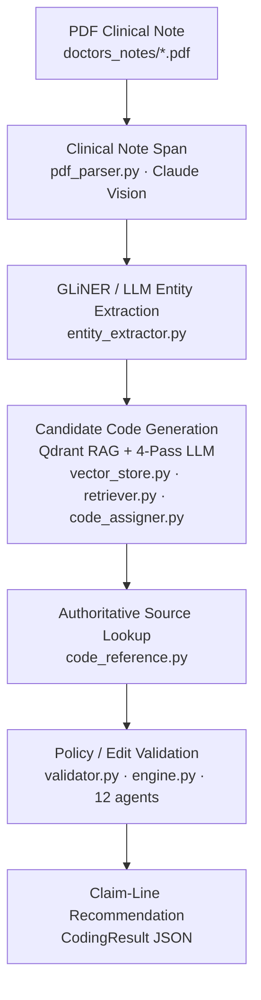

# Podiatry Medical Coding & Clean-Claim Scrubber

Translates podiatry clinical notes (PDF) into ICD-10-CM, CPT, HCPCS, and SNOMED CT codes,
then runs every claim line through a **12-filter pre-submission compliance scrub**.
Only fully clean claims pass; anything that fails any filter is routed to review with
the specific reason, denial risk, and the authoritative rule that triggered it.

> **Interactive pipeline diagram** — open [`pipeline.html`](pipeline.html) in any browser for a
> clickable stage-by-stage breakdown with inputs, outputs, technology, and key details per step.

---

## Pipeline



---

## Pipeline stages

<details>
<summary><strong>1 — Clinical Note Span</strong> &nbsp;·&nbsp; <code>app/ingestion/pdf_parser.py</code></summary>

**Technology:** Claude Opus 4.7 Vision · pdf2image · Poppler

| | |
|---|---|
| **Input** | PDF file (1–2 pages, rendered at 300 DPI) |
| **Output** | Structured JSON: `metadata`, `sections`, `note_category`, `procedures_performed_today`, `physician_documented_codes` |

PDF pages are rendered to images by `pdf2image` then base64-encoded and sent to Claude with adaptive thinking enabled. The model returns rich JSON covering patient metadata, all clinical sections (chief complaint, HPI, PE, assessment/plan), note category, procedures performed today, and any codes the physician already documented.

- Pages rendered at 300 DPI via `pdf2image` / Poppler
- Always uses Claude Vision — **not affected** by `LLM_PROVIDER` setting
- System-prompt caching reduces token cost on repeated note batches
- Reasoning effort configurable via `CLAUDE_EFFORT` (`high` / `max` / `xhigh` for Opus)

</details>

<details>
<summary><strong>2 — GLiNER / LLM Entity Extraction</strong> &nbsp;·&nbsp; <code>app/ner/entity_extractor.py</code></summary>

**Technology:** GPT-4o / Claude (configurable via `LLM_PROVIDER`) · GLiNER-BioMed

| | |
|---|---|
| **Input** | Clinical sections + vision context JSON |
| **Output** | `ClinicalEntity` objects tagged by type and source |

Named entity recognition runs in two passes: the LLM identifies candidate entities across all clinical sections; GLiNER-BioMed validates and confirms each one. Source tags (`gliner_confirmed` vs `llm`) carry forward as confidence signals for the downstream RAG queries.

Entity types: `diagnosis`, `procedure`, `finding`, `supply`, `imaging`

</details>

<details>
<summary><strong>3 — Candidate Code Generation</strong> &nbsp;·&nbsp; <code>app/rag/</code> · <code>app/coding/code_assigner.py</code></summary>

**Technology:** Qdrant · FastEmbed `bge-base-en-v1.5` (768-dim) · BM25 · 4-Pass LLM

| | |
|---|---|
| **Input** | Clinical entities + note sections |
| **Output** | Ranked ICD-10-CM, CPT, HCPCS candidate codes + verified assignments |

**RAG retrieval** — hybrid search over three Qdrant collections (`icd10`, `cpt`, `hcpcs`), run per-entity and per-section. Dense and sparse vectors are fused with Reciprocal Rank Fusion (RRF).

**4-Pass LLM code assignment** — each pass targets a specific system at `CODING_TEMPERATURE=0.0`:

| Pass | System Prompt | Assigns | Notes |
|---|---|---|---|
| 1 | `ICD_SYSTEM_PROMPT` | ICD-10-CM billable codes + `supporting_conditions` | `supporting_conditions` are advisory / non-billable |
| 2 | `CPT_SYSTEM_PROMPT` | CPT procedures, E/M level, imaging | MDM documentation, modifiers `-25` / `-57`, global period annotations |
| 3 | `HCPCS_SNOMED_SYSTEM_PROMPT` | HCPCS supplies / DME / J-codes + SNOMED CT | J-codes for injections; SNOMED enriches clinical specificity |
| 4 | `VERIFICATION_SYSTEM_PROMPT` | Corrections, anchor protection, compliance fixes | Anchor-and-audit self-verification; J-code enforcement |

A **hard DB gate** runs after every pass — any code not found in the authoritative reference tables is dropped before it reaches validation.

</details>

<details>
<summary><strong>4 — Authoritative Source Lookup</strong> &nbsp;·&nbsp; <code>app/rag/code_reference.py</code></summary>

**Technology:** In-memory JSON reference tables (loaded once at startup)

| | |
|---|---|
| **Input** | LLM-generated code candidates |
| **Output** | Validated codes with authoritative descriptions, MUE limits, global periods, NCCI conflict flags |

`CodeReferenceDB` loads the tables below and provides existence validation plus rule lookups. The hard gate removes any hallucinated code; descriptions are then enriched from the same authoritative source.

| File | Contents |
|---|---|
| `data/codes/icd10cm_codes.json` | ICD-10-CM code set (FY2026) |
| `data/codes/cpt_codes.json` | CPT codes + descriptors |
| `data/codes/hcpcs_codes.json` | HCPCS Level II codes |
| `data/codes/ncci_data.json` | NCCI PTP edit pairs (Column 1 / Column 2) |
| `data/codes/ncci_aoc_edits.json` | NCCI Add-On Code edit pairs — 7,743 entries (V2026Q3); each record carries edit type, effective date, and modifier indicator |
| `data/codes/mue_practitioner.json` | MUE unit caps with MAI (1 = line, 2 = absolute, 3 = clinical) |
| `data/codes/podiatry_lcd.json` | LCD coverage policy (qualifying dx + governed CPTs) |
| `data/codes/pos_codes.json` | Place of Service set + facility / non-facility flags |
| `data/codes/modifiers.json` | Recognized modifier reference set |
| `data/codes/modifier_exempt.json` | AMA CPT Appendix E + F merged — modifier 51 exempt and modifier 63 exempt flags per CPT code (2026 Update 4) |
| `data/global_periods.json` | Global surgical period table |
| `data/snomed_root_concepts.json` | SNOMED CT root concept set |

</details>

<details>
<summary><strong>5 — Policy / Edit Validation</strong> &nbsp;·&nbsp; <code>app/validation/validator.py</code> · <code>app/compliance/engine.py</code></summary>

**Technology:** ~20 deterministic rules · Pydantic `Claim` model · 12 compliance agents

| | |
|---|---|
| **Input** | Code-assigned `CodingResult` |
| **Output** | Validation issues, audit score, `CLEAN` / `REVIEW` disposition |

**Layer 1 — `CodingValidator`** runs ~20 deterministic checks with auto-corrections:

- NCCI conflict detection + auto-suppression of bundled CPT codes
- MUE unit limit enforcement
- LCD qualifying-DX check (routine foot care requires a systemic DX)
- Modifier `-25` / `-57` logic with auto-add / remove
- Global surgical period conflict detection
- HCPCS laterality auto-add (RT / LT on L-codes)
- BMI Z-code completeness, DM redundancy, physician-code reconciliation

**Layer 2 — `ClaimScrubber`** normalizes output to a canonical `Claim` model then runs all 12 agents (see next section). The scrubber is the **authoritative gate** — one FAIL finding → disposition `REVIEW`.

</details>

<details>
<summary><strong>6 — Claim-Line Recommendation</strong> &nbsp;·&nbsp; <code>output/results/</code></summary>

**Technology:** Pydantic v2 · JSON · SHA-keyed result cache

| | |
|---|---|
| **Input** | `CLEAN` / `REVIEW` scrub result + all 12 agent findings |
| **Output** | `CodingResult` JSON per note + aggregated `all_results.json` |

Each record carries:
- Billable codes: `icd_codes`, `cpt_codes`, `hcpcs_codes`, `snomed_codes`
- Advisory: `supporting_conditions` (non-billable)
- Provenance per code: `physician_documented` \| `ai_confirmed` \| `ai_replaced_physician` \| `ai_inferred`
- `pre_submission_audit_score` (0.0 – 1.0)
- `claim_scrub` — full 12-agent finding detail
- `final_disposition`: **CLEAN** \| **REVIEW** (authoritative)
- `final_summary` — narrative for human review queue
- Result cache keyed by PDF + pipeline version; compliance scrubber always re-runs on cache hit

</details>

---

## The 12 compliance filters

Each filter is its own self-contained **agent module** (`app/compliance/agents/`), sharing a
common interface and registered in one place. All rules are **data-driven** — no hardcoded
code lists — and every lookup is **date-of-service aware**.

| # | Filter | What it checks | Agent |
|---|---|---|---|
| 1 | Specificity | Code existence, active-for-DOS, unspecified-when-specific-exists | `specificity` |
| 2 | NCCI PTP | Column 1 / Column 2 edit pairs, modifier indicator 0 / 1 / 9 | `ncci_ptp` |
| 3 | MUE unit caps | Per-line unit limits with **MAI** awareness (1=line, 2=absolute, 3=clinical) | `mue_mai` |
| 4 | Modifier validity | Recognized set, X{EPSU}-over-59, RT/LT & 50 conflicts, E/M mod-25 | `modifiers` |
| 5 | Medical necessity | LCD / NCD / Article ICD↔CPT coverage | `medical_necessity` |
| 6 | Global period | E/M inside a prior surgery's window, +24 / 58 / 78 / 79 | `global_period` |
| 7 | Frequency | Per-day and lifetime limits, duplicate-line detection | `frequency` |
| 8 | Add-on codes | Add-on present without its required primary code | `addon` |
| 9 | Place of Service | POS validity + facility / non-facility rate applicability | `pos_eligibility` |
| 10 | Prior authorization | Data-driven required-PA list; FHIR-ready | `prior_auth` |
| 11 | Eligibility & benefits | Stedi 270 / 271 real-time coverage check | `benefits` |
| 12 | Documentation | Code support + modifier justification audit | `documentation` |

**Gate rule:** `CLEAN` requires zero FAIL findings. One or more FAILs → `REVIEW` with the specific finding, denial risk level, and source rule attached.

---

## Key features

- **Claude Vision** reads PDFs as images with adaptive thinking (model + effort configurable)
- **Qdrant hybrid search** — dense FastEmbed `bge-base-en-v1.5` + BM25 sparse; fully local, no embedding API cost
- **Multi-pass coding** with Anchor-and-Audit self-verification pass
- **12-filter clean-claim gate** — single authoritative verdict (`CLEAN` / `REVIEW`)
- **Fully data-driven** — all rules in a versioned, effective-dated SQLite compliance store; a CI guard fails the build if a hardcoded code list is reintroduced
- **Compliance data refresh layer** — pulls CMS / AMA sources on their cadence with full history retention (`run_refresh.py`)
- **Stedi clearinghouse adapter** for eligibility / prior-auth (swappable, FHIR-ready)
- **Pydantic v2 models**, structured logging, SHA-keyed response cache

---

## Project layout

```
app/
├── ingestion/        PDF → structured extraction (Claude Vision)
├── ner/              clinical entity extraction (LLM + GLiNER-BioMed)
├── rag/              Qdrant hybrid retrieval + CodeReferenceDB
├── coding/           4-pass LLM code assignment
├── validation/       deterministic validation engine
└── compliance/       ← the clean-claim scrubber
    ├── datastore/    ComplianceDataStore (SQLite, effective-dated)
    ├── agents/       one ComplianceAgent per filter (12 total)
    ├── adapters/     Stedi eligibility / prior-auth
    ├── refresh/      CMS/AMA source registry + parsers + runner
    ├── models.py     Claim, ClaimLine, Finding, ScrubResult
    └── engine.py     ClaimScrubber (build Claim → run agents → gate)
pipeline.py           orchestrates all 6 stages
```

---

## Quick start (one command)

`setup.sh` bootstraps the whole environment — checks what's already installed,
installs only what's missing, and starts processing. Safe to re-run (idempotent).

```bash
./setup.sh            # Docker mode: builds the stack (Python 3.11 + Poppler + libs + Qdrant) and runs
./setup.sh --native   # host-native: installs Python / libs / Poppler, pre-downloads models, runs locally
./setup.sh --check    # detect & report what's installed/missing — installs nothing
./setup.sh --no-start # set everything up but don't start processing
```

Auto-detects macOS / Linux (brew / apt / dnf / yum), creates `.env` from `.env.example`
if missing, and falls back to the on-disk Qdrant store when Docker isn't present.

> Prefer the manual steps below if you want full control over each component.

---

## Setup

### 1. Install system dependencies

```bash
# macOS
brew install poppler

# Debian / Ubuntu
apt install poppler-utils

# RHEL / Fedora
dnf install poppler-utils
```

### 2. Install Python packages

```bash
pip install -r requirements.txt   # Python 3.11+
```

### 3. Configure environment

Copy `.env.example` to `.env` and fill in your keys:

```bash
cp .env.example .env
```

#### Full `.env` reference

```bash
# ── LLM provider ──────────────────────────────────────────────────────────────
# "claude" (recommended) or "openai"
LLM_PROVIDER=claude

# Anthropic — required when LLM_PROVIDER=claude
ANTHROPIC_API_KEY=sk-ant-REPLACE_ME
# Verified: claude-sonnet-4-6  |  Opus models also supported
CLAUDE_MODEL=claude-sonnet-4-6
# Reasoning effort: high | low | max | medium  (Opus also supports xhigh)
CLAUDE_EFFORT=high

# OpenAI — required when LLM_PROVIDER=openai
OPENAI_API_KEY=sk-REPLACE_ME
OPENAI_MODEL=gpt-4o

# ── Vector store (Qdrant) ──────────────────────────────────────────────────────
# Docker mode: http://qdrant:6333 is set automatically by docker compose
# Native with a local Qdrant server: http://localhost:6333
# Leave QDRANT_URL empty to use the on-disk store (no server needed)
QDRANT_URL=http://localhost:6333
QDRANT_PATH=data/qdrant_store

# ── Input / output paths ───────────────────────────────────────────────────────
# Directory containing PDF notes to process (default: doctors_notes/)
NOTES_DIR=doctors_notes
# Subdirectory of data/ containing JSON reference tables (default: codes)
CODES_DIR=codes

# ── Code reference file overrides (optional) ───────────────────────────────────
ICD10_FILENAME=icd10cm_codes.json
CPT_FILENAME=cpt_codes.json
HCPCS_FILENAME=hcpcs_codes.json
NCCI_FILENAME=ncci_data.json
MUE_FILENAME=mue_practitioner.json
LCD_FILENAME=podiatry_lcd.json

# ── Clearinghouse (eligibility / prior-auth) ───────────────────────────────────
STEDI_API_KEY=test_REPLACE_ME
STEDI_ELIGIBILITY_URL=https://healthcare.us.stedi.com/2024-04-01/change/medicalnetwork/eligibility/v3

# ── Misc ───────────────────────────────────────────────────────────────────────
LOG_LEVEL=INFO
```

#### Runtime defaults (from `app/core/config.py`)

| Setting | Default | Notes |
|---|---|---|
| `LLM_PROVIDER` | `openai` | Switch to `claude` for Anthropic |
| `CLAUDE_MODEL` | `claude-opus-4-7` | Vision extraction always uses Claude regardless of provider |
| `CLAUDE_EFFORT` | `high` | Works on every current model; use `xhigh` for Opus on critical batches |
| `OPENAI_MODEL` | `gpt-4o` | Used for NER + coding passes when `LLM_PROVIDER=openai` |
| `CODING_TEMPERATURE` | `0.0` | All 4 coding passes run deterministically |
| `CODING_MAX_TOKENS` | `4096` | Per coding pass |
| `RAG_TOP_K` | `15` | Candidates retrieved per query |
| `RAG_SIMILARITY_THRESHOLD` | `0.35` | Minimum score to include a RAG result |
| `QDRANT_URL` | *(empty — on-disk)* | Set to server URL in production |

### 4. Start Qdrant (Docker)

```bash
# Qdrant only
docker compose up qdrant -d

# Full stack (Qdrant + app)
docker compose up
```

The app container mounts `doctors_notes/` as read-only, writes results to `output/results/`,
and persists the Qdrant index in `data/qdrant_store/`.

---

## Usage

```bash
# Process all notes in NOTES_DIR
python run.py

# Process a single note by filename
python run.py --note 001_margaret_holloway_note1.pdf

# Force-rebuild the Qdrant collections (after adding new codes)
python run.py --rebuild-index

# Skip the SHA-keyed response cache (force fresh processing)
python run.py --no-cache
```

First run embeds ~94K codes into Qdrant (a few minutes on CPU; use a Qdrant server in production).
Subsequent runs load cached collections in seconds.

### Refresh compliance data

```bash
python run_refresh.py --all            # refresh sources due this month
python run_refresh.py --source mue     # refresh one source
python run_refresh.py --history        # show ingested-snapshot provenance
```

See [deploy/README.md](deploy/README.md) for the full data-loading and cron-scheduling guide.

---

## Output format

Each note produces a JSON file under `output/results/`. The authoritative verdict is
`final_disposition`, driven by the 12-filter scrubber.

```json
{
  "document_id": "001_margaret_holloway_note1",
  "success": true,
  "patient_metadata": { "patient_name": "Margaret Holloway", "date_of_service": "2025-11-04" },

  "icd_codes":    [ { "code": "M20.11", "type": "primary", "confidence": 0.95, "code_source": "ai_confirmed" } ],
  "cpt_codes":    [ { "code": "99204",  "modifiers": ["57"], "linked_diagnoses": ["M20.11"] } ],
  "hcpcs_codes":  [ ... ],
  "snomed_codes": [ ... ],
  "supporting_conditions": [ ... ],

  "final_disposition": "CLEAN",
  "final_summary": "Clean claim — passed all 12 compliance filters.",
  "auto_coding_tier": "AUTO",
  "pre_submission_audit_score": 0.94,

  "claim_scrub": {
    "disposition": "CLEAN",
    "clean": true,
    "summary": "...",
    "findings": [
      {
        "filter_id": "MUE_MAI",
        "status": "FAIL",
        "codes": ["28285-RT"],
        "reason": "Units exceed MUE cap for DOS.",
        "recommendation": "Reduce units to 1.",
        "denial_risk": "HIGH",
        "source_rule": "NCCI MUE ... MAI=2 (eff on DOS)"
      }
    ]
  }
}
```

**`final_disposition` values:**

| Value | Meaning |
|---|---|
| `CLEAN` | Zero FAIL findings across all 12 agents — safe to submit |
| `REVIEW` | One or more FAIL findings — human coder must resolve before submission |

**Code source tags** on every code:

| Tag | Meaning |
|---|---|
| `physician_documented` | Physician wrote this code; AI confirmed it |
| `ai_confirmed` | AI assigned; matches physician documentation |
| `ai_replaced_physician` | AI replaced a physician code (reason logged) |
| `ai_inferred` | AI-only — no physician documentation |

---

## Testing

```bash
python -m tests.test_agents          # 40 adversarial tests — every filter's pass/fail boundaries
python -m tests.scrub_fixtures       # run the scrubber over sample documents' coded output
python -m tests.test_refresh         # parsers + history-retentive ingestion
python -m tests.check_no_hardcoding  # CI guard: fails if a hardcoded code list reappears
```

---

## Tech stack

| Layer | Technology |
|---|---|
| PDF ingestion | Claude Opus 4.7 Vision · pdf2image · Poppler |
| Entity extraction | GPT-4o / Claude · GLiNER-BioMed |
| Vector search | Qdrant · FastEmbed `bge-base-en-v1.5` (768-dim cosine) · BM25 sparse · RRF fusion |
| Code assignment | 4-pass LLM (OpenAI GPT-4o or Anthropic Claude) · temperature 0.0 |
| Reference lookup | In-memory JSON: ICD-10-CM, CPT, HCPCS, NCCI PTP + AOC, MUE, LCD, POS, Modifiers |
| Rule validation | ~20 deterministic rules · auto-corrections (Pydantic v2) |
| Compliance gate | 12 specialized agents · canonical `Claim` model · SQLite effective-dated store |
| Clearinghouse | Stedi 270 / 271 (FHIR-ready, swappable) |
| Output | Pydantic v2 · JSON · SHA-keyed result cache |

---

## Requirements

- Python 3.11+
- A valid LLM API key — Anthropic (`ANTHROPIC_API_KEY`) or OpenAI (`OPENAI_API_KEY`)
- Poppler: `brew install poppler` (macOS) / `apt install poppler-utils` (Linux)
- Qdrant server (optional but recommended for production; on-disk store works for development)
